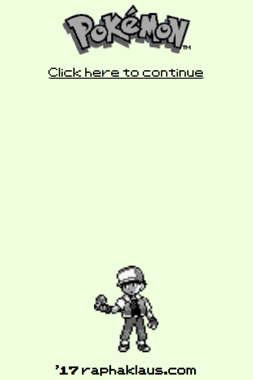
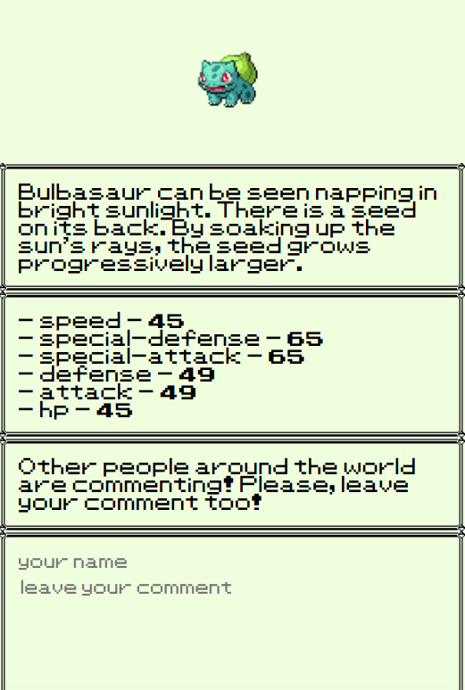

## Pokedex 
Pokedex application allows you to browse Pokémons, check their stats and leave comments.
Made with AngularJS and Parcel. Backend using NodeJS and Express. Docker to run the entire project.

  

  

## Running

* `docker-compose up -d`
* Visit `localhost` in your browser.

## Testing

* `docker-compose up tester`
